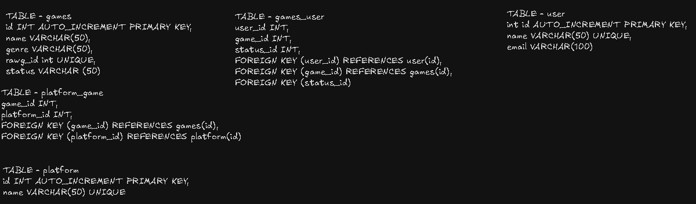

# Gaming library

## About the project
Gaming Library is a Java application that allows users to search for games using the [RAWG Video Games Database API](https://rawg.io/apidocs), add games to their personal library, and manage their game status.
The application uses **Java as the backend** and **MySQL for data persistence**, with JDBC being responsible for communication between the application and the database.
The project was developed for **educational purposes**, with the main goal of consolidating concepts learned during my Java and database studies.

## Features!
- User registration
- Game search using the RAWG API
- Add games to a personal library
- View a user's game library
- Change the status of games
- Associate games with their available platforms
- Persist application data using MySQL

## Technologies

- **Java** — Main programming language
- **JDBC** — Database communication
- **MySQL** — Data persistence
- **Gson** — JSON deserialization
- **HikariCP** — Database connection pooling
- **RAWG API** — External game data

## Database

The project uses a relational database to store users, games, platforms, and their relationships.

The main relationships include:

- Users ↔ Games
- Games ↔ Platforms

The `games_user` relationship also stores the user's current status for each game.

## Installing the project
### Step 1)
Install de raw projct.

### Step 2)
Open it on your IDE.

### Step 3)
Create the required MySQL database and tables.

## Using the project
just execute the main class normally on your IDE.